# Sthack 2019 - CTF - Ticket Checker
*Creator of the challenge:* Ghozt

*Category:* WEB

*Difficulty:* Medium

## **Step 1: Follow the errors**

Reaching the website, we get a webpage allowing you to scan a ticket (QRCode) using your camera.

Once done, we get the following error:

Hum...

From Burp, we intercept the request and save it for later.

We use the tool "qrencode" to create a QRCode to put the content we want inside.

For all the next steps, the process will be like the following:
* Create a QRCode using qrencode, containing our data to be tested inside
* Base64 encode the output of the command
* Replay it throught the repeater in burp

Let's start with an empty json:

+  *qrencode '{}' -o - | base64 -w 0*
+  *-o -*: output directly on the standard output
+  *-w 0* : disable line wrapping

We put the output into the raw-data of the data image in the "**image**" parameter.

Be carefull to encode the base64 just added to avoid the following error:
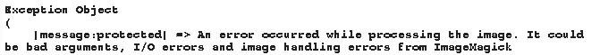

Once encoded:

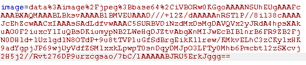

**OK !** New error message, that the key '<b>uid</b>' is missing in the JSON.

## **Step 2: Find the entry point**

Let's add it and retry...

Now we get a correct output telling us that the ticket has already been used:

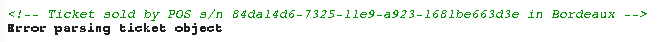

But if we use one which may be unknown, we get a database error.

## **Step 3: Injection SQL - Integer Based**

Let's try some SQL Injection as we are requesting the database!

We will not detail all SQL Injection tested using 'single quote', "double quote" and so on... Here, it is an interger based!

We need to know the right number of columns used by the database. Using "order by" with 5 columns, we get an error: 

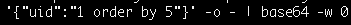

But using 4, it is ok meaning that we have 4 columns used. Output "2" and "3" are displayed, thus we can use it to exploit our SQL Injection:

*qrencode '{"uid":"100000000 union select 1,2,3,4"}' -o - | base64 -w 0*

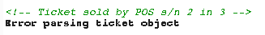

Extracting the current user, the database... 

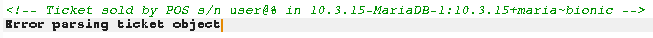

**Nice** but could we do something better with that? Actually yes => read some local files!

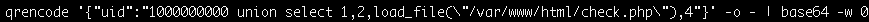

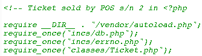

**Great!!!**
We can leak the source code of the application located in /var/www/html/

The usefull files to continue the challenge are:
* check.php
* ticket.php

## **Step 4: Read the source code and understand it**

By analyzing the check.php and the Ticket.php files, our final goal is to reach the call to the log() function from the Ticket class. In this function, there is a call to the system function with one controlled user input:

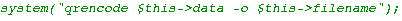

It may be a **PHP Object Injection!** Let's verify it...

Back to the check.php file, if there is no **t_uid, object, and sign** keys in the JSON, the program terminates his execution.

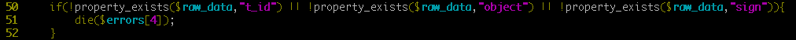

We add those JSON keys to continue the execution and pass the condition.

The program request the database for a KEY which will be used to create a Signature object.

Let's grab it! It would be usefull:

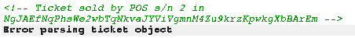

After getting the key, the program create a Signature Object. Call the method Check(), dies if the check is wrong.

If not, we continue to the unserialize call and the log function from the Ticket class. All leading to the system call!

To pass the signature, we get the source code of the Ticket.php file on our machine to modify it and pass the check. We need to change some parts:

* Changing the filename in the History class to avoid our php object to be different at every tries on our local test
* Hardcoding the key in the Signature class as localy it will not request the database
* Adding the following source code to display the values we need to set in the **object** and **sign** keys:

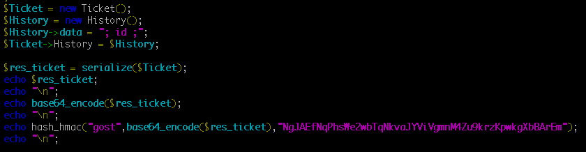

I will explain the added part:

* Creation of a new Ticket instance that will be used on the unserialize call
* Creation of a new History instance needed in the Ticket class
* Changing the value of data in the History class. This value will be injected to the system function leading to a **CODE EXECUTION**
* Linking the new History instance into the Ticket instance
* Serialize the Ticket instance
* Base64 encode the output
* Sign it using the hash_hmac methode took from the Signature class

## **Step 5: Create your most beautiful object!**

The output of the modified php file will be like:

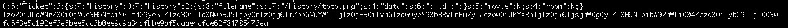

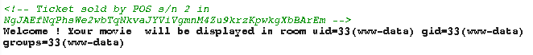

Let's analyze the server in order to get the flag and finaly have a break to drink a bit!

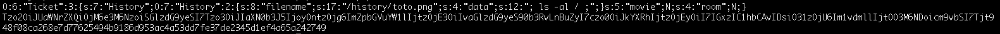

Let's create the QRCode for this:

*qrencode '{"uid":"1000000000 union select 1,2,(SELECT cipher_key FROM cipher_keys LIMIT 1),4","t_id":"1","object":"Tzo2OiJUaWNrZXQiOjM6e3M6NzoiSGlzdG9yeSI7Tzo3OiJIaXN0b3J5IjoyOntzOjg6ImZpbGVuYW1lIjtzOjE3OiIvaGlzdG9yeS90b3RvLnBuZyI7czo0OiJkYXRhIjtzOjEyOiI7IGxzIC1hbCAvIDsiO31zOjU6Im1vdmllIjtOO3M6NDoicm9vbSI7Tjt9","sign":"48f08ca268e7d77625494b9186d953ac4a53dd7fe37de2345d1ef4a65a242749"}' -o - | base64 -w 0*

**Object**: contain the Ticket instance

**Sign**: hash_hmac of the object using the key

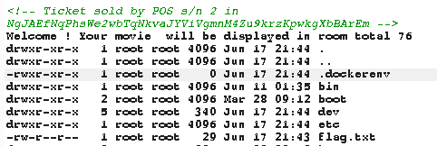

## **Step 6: Get the flag, and go drink a beer!**

Get the flag!

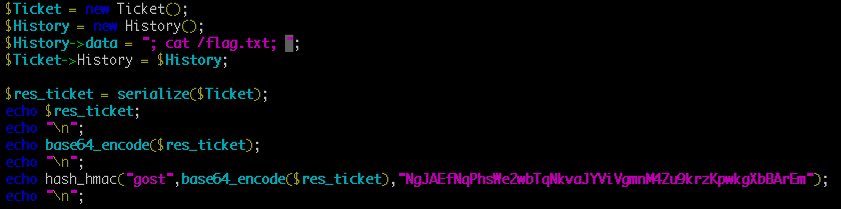

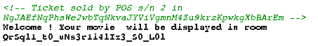

Flag is: QrSql1_t0_uNs3r1i4lIz3_S0_L0l

